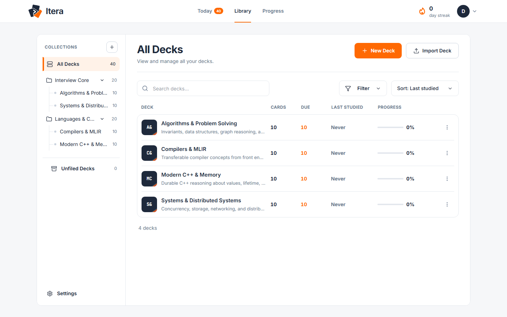
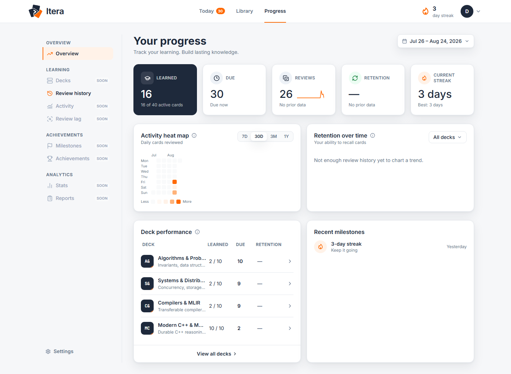
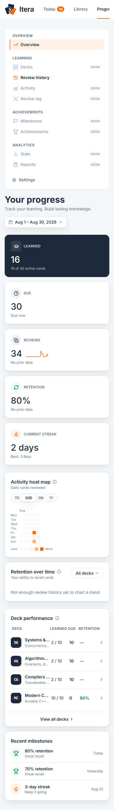
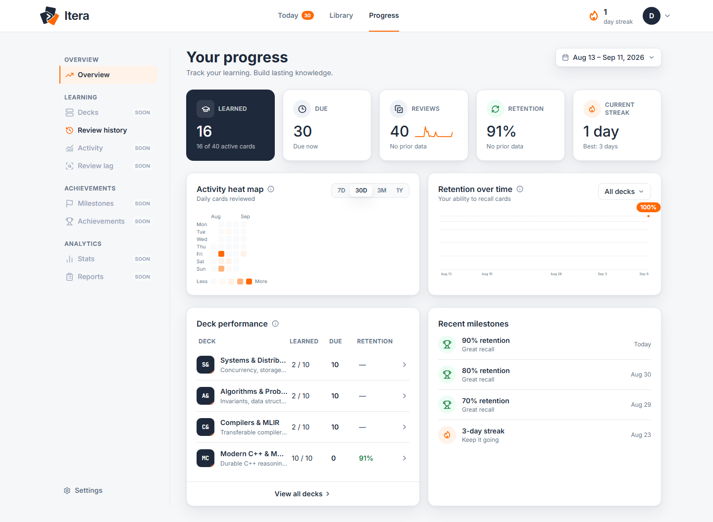

# Itera MVP QA / dogfooding report

**Test date:** 2026-08-21  
**Virtual Day 1:** 2026-08-21  
**Controlled timezone:** Europe/Belgrade  
**Result:** PASS WITH ISSUES

## 1. Executive result

**PASS WITH ISSUES**

Itera is ready for continued real-user dogfooding and has no MVP correctness blocker. The complete Import → Review → FSRS persistence → controlled time advance → due query → Today/Progress/History loop worked.

Nothing blocks a polished demo, though two visible polish issues should be addressed during demo-polish work:

- “Best: 1 days” pluralization.
- Isolated retention buckets can disappear from the chart.

The pristine seed remained unchanged: SHA-256 `54A5CFC7A1247F5F01932E11BA0B90B1A6BC263390E4E96609D7617A34A45277`. No product code was changed.

## 2. Imported dataset verification

The real **Import JSON → Merge** UI reported:

> Imported 40 cards, 6 decks, 0 drafts.

Observed structure:

- 2 parent Collections with no directly listed cards:
  - Languages & Compilers: 20-card rollup
  - Interview Core: 20-card rollup
- 4 leaf decks, each with 10 cards:
  - Modern C++ & Memory
  - Compilers & MLIR
  - Algorithms & Problem Solving
  - Systems & Distributed Systems
- Initial due queue: 40
- Interaction coverage:
  - Recall: 14
  - Multiple Choice: 7
  - Write Code: 5
  - Ordering: 4
  - Matching: 4
  - Walkthrough: 6

## 3. Temporal timeline

Virtual Day 1 was **2026-08-21**, using stable local midday in `Europe/Belgrade`.

| Day | Date | Reviews | Due before → after | Current / best streak | Learned | Retention | Observation |
|---:|---|---:|---:|---:|---:|---:|---|
| 1 | Aug 21 | 13 | 40 → 28 | 1 / 1 | 13 | — | All decks and all six interactions exercised |
| 2 | Aug 22 | 6 | 37 → 31 | 2 / 2 | 16 | — | Learning cards returned naturally |
| 3 | Aug 23 | 7 | 35 → 28 | 3 / 3 | 16 | — | C++ deck reached 0 due |
| 4 | Aug 24 | 0 | 30 → 30 | 3 / 3 | 16 | — | Grace day preserved streak |
| 5 | Aug 25 | 1 | 30 → 29 | 1 / 3 | 16 | — | Streak was 0 before review, then restarted |
| 6* | Aug 26 | 0 | 30 → 30 | 1 / 3 | 16 | — | Grace after Day 5 |
| 7* | Aug 27 | 0 | 31 → 31 | 0 / 3 | 16 | — | New streak broke |
| 8* | Aug 28 | 0 | 31 → 31 | 0 / 3 | 16 | — | Missed day |
| 9 | Aug 29 | 6 | 35 → 30 | 1 / 3 | 16 | 75% | Initially 67%; relearning success raised it to 75% |
| 10 | Aug 30 | 1 | 31 → 30 | 2 / 3 | 16 | 80% | Mature Easy counted as success |
| 11* | Aug 31 | 0 | 31 → 31 | 2 / 3 | 16 | 80% | Grace day |
| 12* | Sep 1 | 0 | 31 → 31 | 0 / 3 | 16 | 80% | Streak broke |
| 13* | Sep 2 | 0 | 31 → 31 | 0 / 3 | 16 | 80% | No reviews |
| 14* | Sep 3 | 0 | 33 → 33 | 0 / 3 | 16 | 80% | Two mature cards became due |
| 15* | Sep 4 | 0 | 34 → 34 | 0 / 3 | 16 | 80% | Another mature return |
| 16* | Sep 5 | 0 | 34 → 34 | 0 / 3 | 16 | 80% | No reviews |
| 17* | Sep 6 | 0 | 34 → 34 | 0 / 3 | 16 | 80% | No reviews |
| 18* | Sep 7 | 0 | 34 → 34 | 0 / 3 | 16 | 80% | No reviews |
| 19* | Sep 8 | 0 | 34 → 34 | 0 / 3 | 16 | 80% | No reviews |
| 20* | Sep 9 | 0 | 34 → 34 | 0 / 3 | 16 | 80% | Next due occurred seconds after sampled midday |
| 21* | Sep 10 | 0 | 35 → 35 | 0 / 3 | 16 | 80% | No reviews |
| 22 | Sep 11 | 6 | 36 → 30 | 1 / 3 | 16 | 91% | Six mature successes after a chart gap |

`*` These unchanged days were derived read-only from the persisted FSRS schedule captured after the preceding UI session; no scheduling state was mutated.

Day 4 correctly preserved the streak:

Day 5 correctly broke it while preserving best streak 3:

## 4. Feature findings

### Today

- Due agreed with Progress whenever both routes were remounted at the same pinned instant.
- Initial duration estimate was 13 minutes for 40 cards. It adapted as real duration samples accumulated, later showing 16, 12, 7, and 6 minutes.
- Contributing deck names and `+1 more` behavior were correct.
- Current streak, mature Retention, Due today, Next milestone, and Continue Learning all updated from real history.
- Continue Learning prioritized actionable/recent decks and switched caught-up C++ from **Continue** to **Open**.
- Heat-map evidence showed 13, 6, 7, 0, and 1 reviews on the expected dates.
- Zero-review periods rendered honestly, including “No reviews in the last 7 days.”
- Adjust session scoped Compilers & MLIR to a custom two-card session and launched `/review?deck=compilers-mlir&limit=2` as `1 of 2`.
- Global caught-up/next-due presentation was not reached because 30 cards deliberately remained due.

### Review

- All six interactions completed through production Review.
- Queue snapshots remained stable: partial sessions advanced against their original totals despite due-query invalidations.
- Both correct and incorrect objective submissions were exercised.
- Correct MCQ recommended Good but was overridden to Easy.
- Incorrect Write Code recommended Again but was overridden to Hard.
- Tips appeared before answers; Explanations appeared after submission/reveal.
- Code-heavy Walkthrough highlighting and step-scoped Tip/Explanation worked.
- Ordering accepted keyboard drag input and required explicit submission.
- Completion showed **All done**; Undo restored the last card and re-grading completed the session again.
- Genuine review durations were persisted without real waits.

### Library

- Collection rollups were 20 cards each.
- All four leaf decks showed 10 cards.
- Due, last-studied, and schedule-based progress values updated after reviews.
- Last-studied moved through **Just now**, **23h ago**, and **2 days ago** coherently.
- Deck-scoped Study links opened matching snapshot queues.

### Progress

- Learned, Due, Reviews, Retention, and Current streak matched their documented definitions.
- Seven-day range showed 8 Reviews and `69% vs` the previous period.
- Deck Performance ordered actionable due decks first and linked due rows to their deck review scope.
- Recent milestones appeared naturally at 3-day streak and 70/80/90% retention thresholds.
- Phone layout remained within `390px` with all KPIs and Deck Performance usable.

### Review History

- Final history contained 40 real ReviewLogs.
- Rows were newest-first with correct card, deck, rating, interval, and local timestamp.
- Pagination showed `1–25 of 34`, then `26–34 of 34` when first tested.
- Again filter returned exactly three rows.
- Systems & Distributed Systems filter returned exactly its two reviews.
- No console or page errors occurred in the secure `.localhost` controlled context.

## 5. Bugs

### UX/polish: isolated retention buckets disappear

**Reproduction**

1. Create mature reviews on Aug 29–30.
2. Leave a multi-bucket gap.
3. Create more mature reviews on Sep 11.
4. Open Progress with the 30-day range.

**Expected:** Both observed periods are represented, with no line bridging the null buckets.

**Actual:** The earlier singleton run disappears. The SVG had no `data-retention-segment` paths and displayed only the last known marker.

**Likely root cause:** `buildRetentionLinePaths()` discards runs shorter than two points, while `RetentionChart` renders a marker only for the final known point.

**Affected files:**

- `src/features/progress/components/retentionChartPath.ts`
- `src/features/progress/components/RetentionChart.tsx`

### UX/polish: singular best-streak grammar

**Reproduction:** Create one review and open Progress.

**Expected:** `Best: 1 day`

**Actual:** `Best: 1 days`

**Likely root cause:** Fixed plural in `src/features/progress/ProgressPage.tsx:170`.

### Minor/non-blocking: insecure LAN development origin can blank the app

**Reproduction:** Open the Vite LAN URL over plain HTTP, such as `http://192.168.x.x:4177`.

**Expected:** App starts, or ID generation has a compatible fallback.

**Actual:** Startup can fail with `TypeError: crypto.randomUUID is not a function`.

**Likely root cause:** `crypto.randomUUID()` is secure-context dependent. Fixture IDs are generated during imported router-module evaluation, so the failure affects ordinary routes too.

**Affected files:**

- `src/lib/id.ts`
- `src/features/design-preview/fixtures.ts`

Normal `localhost`, `.localhost`, and HTTPS behavior was unaffected. This matters mainly for physical-phone LAN testing.

## 6. UX/polish findings

- Fix singular/plural streak copy.
- Render a dot for every isolated known retention bucket, not only the final one.
- Consider whether the LAN development URL should be a supported phone-testing path; if yes, provide an ID fallback or HTTPS workflow.
- No persistent phone overflow reproduced. A transient 391px measurement during an Ordering transition settled to exactly 390px.

## 7. Deferred behavior correctly observed

The following initially incomplete-looking behavior matched canonical documentation and was not treated as a defect:

- Seven Progress destinations remain focusable **Soon** rows.
- Settings sections other than Import / Export remain placeholders.
- No Weekly Goal exists.
- No persisted StudySession or resumable session exists.
- Adjust session settings are transient.
- Collections remain UI-derived from `Deck.parentId`.
- Retention is mature-only and displays `—`, not `0%`, without eligible attempts.
- Review queues are per-mount snapshots.
- Roadmaps remain outside primary navigation.
- Parent decks do not receive Deck Performance rows that would double-count leaf work.
- Review History reflects current card/deck metadata rather than forensic snapshots.

## 8. Recommendation

**Ready for demo-polish work.**

Continue dogfooding immediately. Before a polished public demo, fix the streak pluralization and retention singleton rendering. Neither requires new product scope or architectural change.
